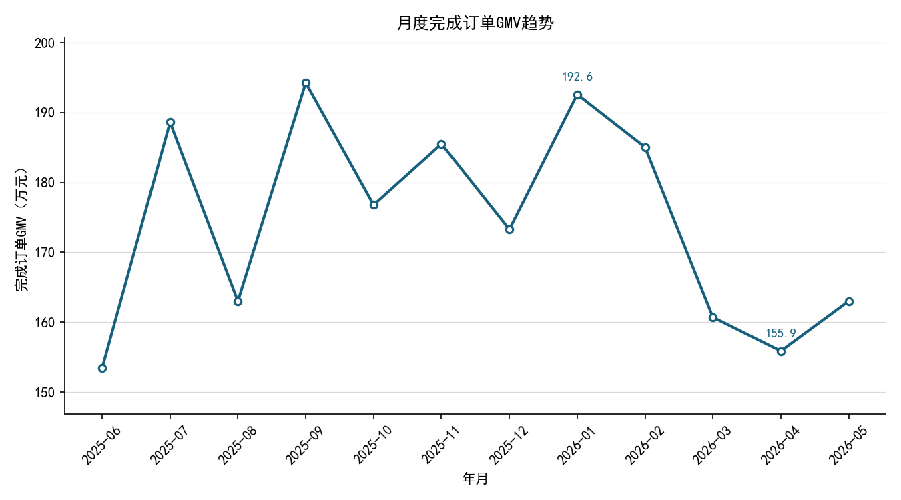
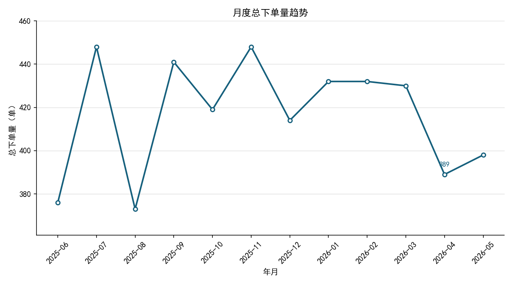
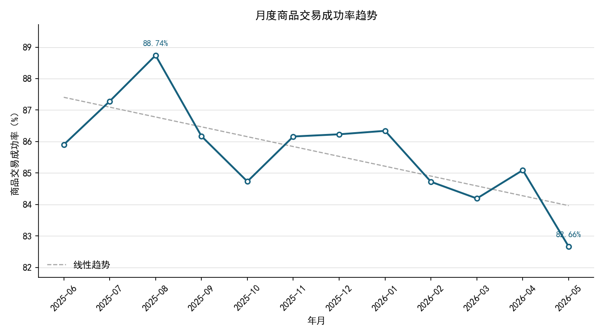
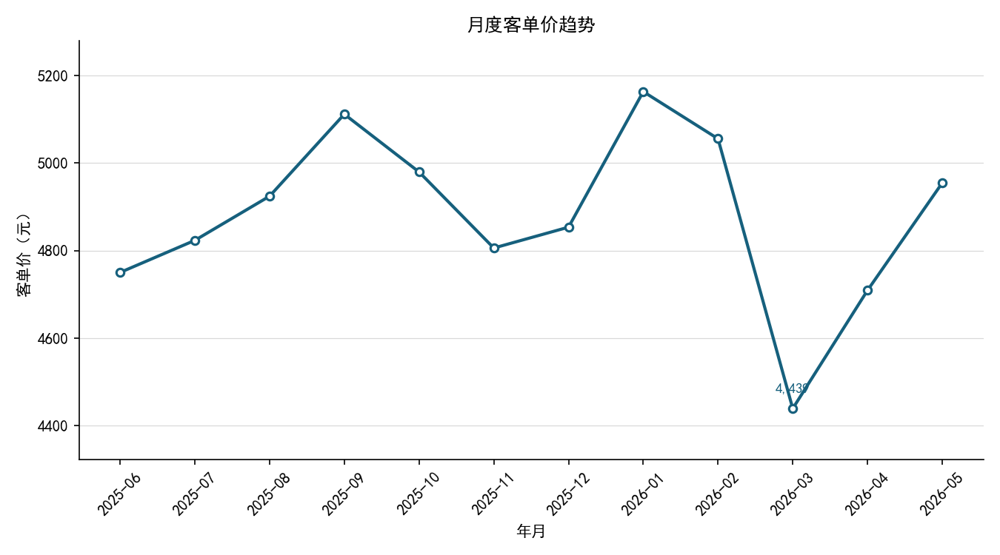
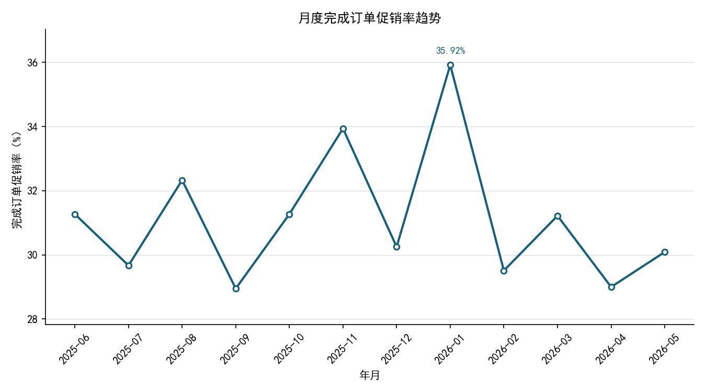
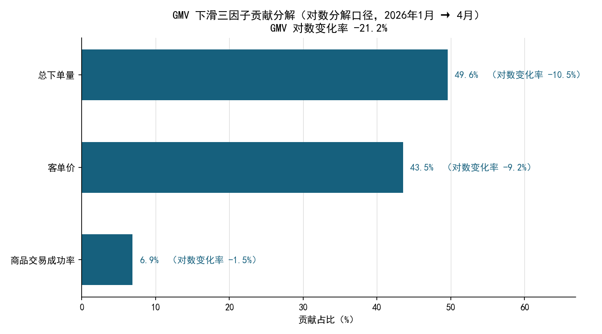
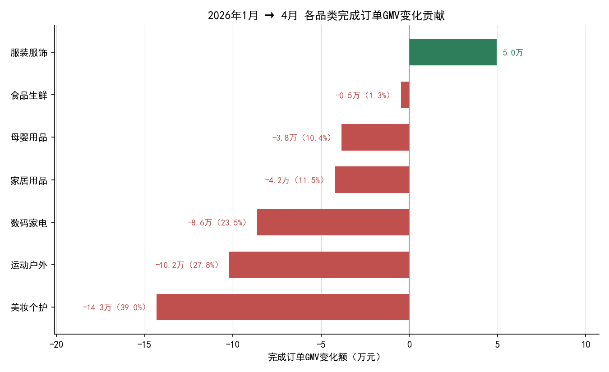
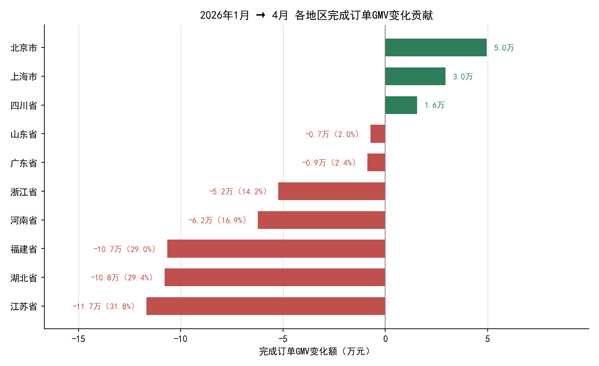
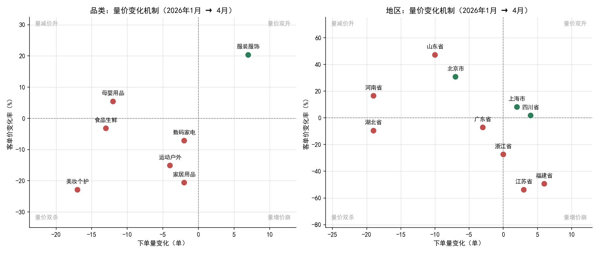

***产品核心价值***：为用户提供商品交易的途径

***北极星指标候选***：完成订单GMV（口径：统计订单日期2025-06-2026-05的订单金额【业务状态为已完成，排除待发货、已取消、退款中】，按订单ID去重，单位：元）

***驱动指标1***：总下单量（口径：统计订单日期2025-06-2026-05的订单ID聚合【业务状态为已完成、待发货、已取消、退款中】，按订单ID去重，单位：单）

***驱动指标2***：商品交易成功率（口径：统计订单日期2025-06-2026-05的商品交易成功率【完成订单数（业务状态为已完成，排除待发货、已取消、退款中） /总下单量（业务状态为已完成、待发货、已取消、退款中）】，按订单ID去重，单位：%）

***驱动指标3***：客单价（口径：统计订单日期2025-06-2026-05的客单价【完成GMV / 完成订单数】，业务状态为已完成，排除待发货、已取消、退款中的订单，按订单ID去重，单位：元）

***护栏指标***：完成订单促销率（口径：统计订单日期2025-06-2026-05的订单促销率【是否促销为1的完成订单数 / 完成订单数；】，按订单ID去重，单位：%）

完成订单GMV = (总下单量 x 商品交易成功率) x 客单价 

**GMV波动分析**

<em>图1　2025年6月—2026年5月 月度完成订单GMV趋势</em>

<em>图2　2025年6月—2026年5月 月度总下单量趋势</em>

<em>图3　2025年6月—2026年5月 月度商品交易成功率趋势</em>

<em>图4　2025年6月—2026年5月 月度客单价趋势</em>

<em>图5　2025年6月—2026年5月 月度完成订单促销率趋势</em>

 一、现状：GMV 全年在区间内波动

    由图1可知2025年6月—2026年5月，完成订单GMV在 **153.4万 ~ 194.2万元**之间波动，月均值 174.3万元，波动幅度（标准差÷均值）8.5%，**全年没有明显的上升或下降方向**,**但2026年1月到4月连续下滑**，需要重点归因

    由图2可知总下单量在 **373 ~ 448单**之间波动，月均值约417单。2026年4月跌至389单，为近10个月最低点

    由图3可知，商品交易成功率在 82.66% ~ 88.74%之间波动，整体呈**缓慢下降趋势**。2025年8月最高88.74%，2026年5月最低82.66%，**下降了6.08个百分点**。

    由图4可知，客单价在 **4439 ~ 5163元**之间波动，月均值约4871元。2026年3月出现**断崖式下跌**，跌至4439元，为全年最低点。

    由图5可知，完成订单促销率在 28.95% ~ 35.92%**之间波动，月均值约31.2%。2026年1月促销率最高（35.92%），但同月GMV也最高，说明**促销在1月起到了拉动作用；而2026年3月促销率31.22%，GMV却大幅下滑，说明**促销未能阻止3月的下跌**。

二、归因：

    **完成订单GMV = 总下单量 × 商品交易成功率 × 客单价**

<em>图6　GMV及驱动指标变化率对比</em>

    由图6可知（**对数分解口径**），2026年1→4月GMV下滑的第一主因是**总下单量**，贡献占比 **49.6%**；第二主因是**客单价**，占 **43.5%**；**商品交易成功率**占 **6.9%**，三者合计 100%，成功率影响最小，但全年呈缓慢下降趋势，需警惕。

三、下钻：下滑集中在哪些品类与地区

    用同口径对 **商品分类** 与 **用户所在地区** 做加法分解：各维度 ΔGMV 之和恰等于总 ΔGMV（-36.72万元），贡献占比合计 100%。

<em>图7　2026年1月→4月 各品类完成订单GMV变化贡献</em>

    **品类：7 个品类 6 降 1 升，拖累高度集中。** 由图7可知，前三大拖累合计占下滑的 **90.3%**：

| 商品分类 | GMV变化额     | 贡献占比   | 下单量变化 | 客单价变化率 | 主因        |
|:---- | ----------:| ------:| -----:| ------:|:--------- |
| 美妆个护 | -14.33万    | 39.0%  | -17 单 | -22.9% | 量价双杀      |
| 运动户外 | -10.20万    | 27.8%  | -4 单  | -15.1% | 价格侧       |
| 数码家电 | -8.63万     | 23.5%  | -2 单  | -7.2%  | 价格侧（体量最大） |
| 家居用品 | -4.23万     | 11.5%  | -2 单  | -20.6% | 价格侧       |
| 母婴用品 | -3.83万     | 10.4%  | -12 单 | +5.4%  | 量侧        |
| 食品生鲜 | -0.47万     | 1.3%   | -13 单 | -3.2%  | 量侧        |
| 服装服饰 | **+4.96万** | -13.5% | +7 单  | +20.3% | 逆势增长      |

    其中 **美妆个护** 是最大拖累，下单量减少 17 单的同时客单价下跌 22.9%，量价同时恶化；**数码家电** 降幅最小（-12.4%）但 1 月基数最大（69.5万元），绝对减量仍达 8.6万元。**服装服饰** 是唯一逆势增长的品类（+47.4%），可作为后续拉动的抓手。

<em>图8　2026年1月→4月 各地区完成订单GMV变化贡献</em>

    **地区：10 个地区 7 降 3 升，江苏/湖北/福建三省贡献九成下滑。** 由图8可知，前三地区合计占 **90.2%**：

| 用户所在地区 | GMV变化额     | 贡献占比   | 下单量变化    | 客单价变化率     | 主因    |
|:------ | ----------:| ------:| --------:| ----------:|:----- |
| 江苏省    | -11.68万    | 31.8%  | **+3 单** | **-53.9%** | 价格侧崩塌 |
| 湖北省    | -10.80万    | 29.4%  | -19 单    | -9.6%      | 量侧    |
| 福建省    | -10.66万    | 29.0%  | **+6 单** | **-49.4%** | 价格侧崩塌 |
| 河南省    | -6.22万     | 17.0%  | -19 单    | +16.5%     | 量侧    |
| 浙江省    | -5.23万     | 14.2%  | 0 单      | -27.4%     | 价格侧   |
| 广东省    | -0.88万     | 2.4%   | -3 单     | -7.2%      | —     |
| 山东省    | -0.72万     | 2.0%   | -10 单    | +47.1%     | —     |
| 四川省    | **+1.55万** | -4.2%  | +4 单     | +1.8%      | 逆势增长  |
| 上海市    | **+2.95万** | -8.0%  | +2 单     | +8.1%      | 逆势增长  |
| 北京市    | **+4.97万** | -13.5% | -7 单     | +30.8%     | 逆势增长  |

    地区间的下滑机制完全不同，需要分开施策：**江苏、福建属于「量增价崩」**——下单量分别增加 3 单、6 单，但客单价近乎腰斩（-53.9%、-49.4%），说明订单结构向低价商品严重偏移（推测为高单价品类订单减少，待下钻验证），而非用户流失；**湖北、河南属于「量崩价稳」**——下单量各减少 19 单，客单价未降（湖北 -9.6%、河南 +16.5%），是真实的用户/订单流失；**北京、上海、四川** 逆势增长，北京客单价上行 30.8%，与江苏福建的低价化趋势相反。

<em>图9　下钻结论：品类与地区下滑机制对照</em>

四、结论

| #   | 结论                                                          | 建议                                 |
|:--- |:----------------------------------------------------------- |:---------------------------------- |
| 1   | 下滑是**结构性**的：90% 集中在 3 个品类、3 个地区 | 不铺开做全量促销，资源集中到美妆个护、运动户外、数码家电与苏鄂闽三省 |
| 2   | **价格侧下滑（客单价）与量侧下滑（下单量）各占约一半**，且不同地区机制相反                     | 江苏/福建查订单结构与折扣策略；湖北/河南查流量与转化漏斗      |
| 3   | 服装服饰、北京/上海/四川逆势增长                                           | 复盘其商品结构与定价策略，尝试复制到下滑地区             |
| 4   | 商品交易成功率全年缓慢下降 6.08 个百分点                                     | 纳入日常监控看板，作为护栏指标持续跟踪                |
