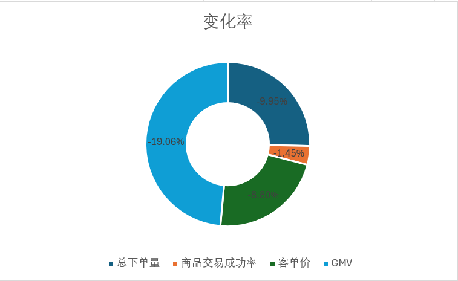

***产品核心价值***：为用户提供商品交易的途径

***北极星指标候选***：完成订单GMV（口径：统计订单日期2025-06-2026-05的订单金额【业务状态为已完成，排除待发货、已取消、退款中】，按订单ID去重，单位：元）

***驱动指标1***：总下单量（口径：统计订单日期2025-06-2026-05的订单ID聚合【业务状态为已完成、待发货、已取消、退款中】，按订单ID去重，单位：单）

***驱动指标2***：商品交易成功率（口径：统计订单日期2025-06-2026-05的商品交易成功率【完成订单数（业务状态为已完成，排除待发货、已取消、退款中） /总下单量（业务状态为已完成、待发货、已取消、退款中）】，按订单ID去重，单位：%）

***驱动指标3***：客单价（口径：统计订单日期2025-06-2026-05的客单价【完成GMV / 完成订单数】，业务状态为已完成，排除待发货、已取消、退款中的订单，按订单ID去重，单位：元）

***护栏指标***：完成订单促销率（口径：统计订单日期2025-06-2026-05的订单促销率【是否促销为1的完成订单数 / 完成订单数；】，按订单ID去重，单位：%）

完成订单GMV = (总下单量 x 商品交易成功率) x 客单价 

**GMV波动分析**

<em>图1　2025年6月—2026年5月 月度完成订单GMV趋势</em>

<em>图2　2025年6月—2026年5月 月度总下单量趋势</em>

<em>图3　2025年6月—2026年5月 月度商品交易成功率趋势</em>

<em>图4　2025年6月—2026年5月 月度客单价趋势</em>

<em>图5　2025年6月—2026年5月 月度完成订单促销率趋势</em>

 一、现状：GMV 全年在区间内波动

    由图1可知2025年6月—2026年5月，完成订单GMV在 **153.4万 ~ 194.2万元**之间波动，月均值 174.3万元，波动幅度（标准差÷均值）8.5%，**全年没有明显的上升或下降方向**,**但2026年1月到4月连续下滑**，需要重点归因

    由图2可知总下单量在 **373 ~ 448单**之间波动，月均值约417单。2026年4月跌至389单，为近10个月最低点

    由图3可知，商品交易成功率在 82.66% ~ 88.74%之间波动，整体呈**缓慢下降趋势**。2025年8月最高88.74%，2026年5月最低82.66%，**下降了6.08个百分点**。

    由图4可知，客单价在 **4439 ~ 5163元**之间波动，月均值约4871元。2026年3月出现**断崖式下跌**，跌至4439元，为全年最低点。

    由图5可知，完成订单促销率在 28.95% ~ 35.92%**之间波动，月均值约31.2%。2026年1月促销率最高（35.92%），但同月GMV也最高，说明**促销在1月起到了拉动作用；而2026年3月促销率31.22%，GMV却大幅下滑，说明**促销未能阻止3月的下跌**。

二、归因：

    **完成订单GMV = 总下单量 × 商品交易成功率 × 客单价**

<em>图6　GMV及驱动指标变化率对比</em>

    由图6可知GMV下滑的第一主因是总下单量，贡献了约-9.95%的降幅，占整体下滑的**52%**。第二主因是客单价，贡献了约-8.80%的降幅，占整体下滑的**46%**。**商品交易成功率影响较小**，仅贡献-1.45%，但全年呈缓慢下降趋势，需警惕。
